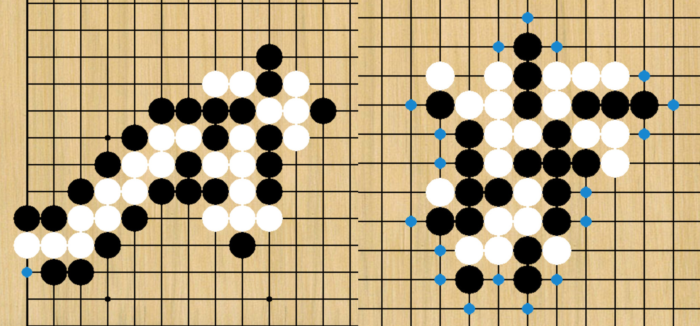

## "Mini" Go Game with Classic AI Agents

An "easier" version of Go game implemented in Python 3, with more constraints on legal moves, and simpler winning condition.

GUI is provided for human to play; legal actions at each turn are indicated on the board as blue dots.

The following AI agents are also provided:
* Random agent
* Greedy agent
* Minimax search agent with alpha-beta pruning
* Expectimax search agent
* Approximate Q-learning agent



### Usage

Install dependencies: `pip install -r requirements.txt`

#### Start A Match

See usage on `match.py`.

#### Examples:

**human** vs. **human**: `./match.py`

**random agent** (BLACK) vs. **human** (WHITE): `./match.py -b random`

**minimax agent with search depth** 1 (BLACK) vs. **human** (WHITE): `./match.py -b minimax`

**expectimax agent with search depth** 2 (BLACK) vs. **human** (WHITE): `./match.py -b expectimax -d 2`

**Q-learning agent** (BLACK) vs. **human** (WHITE): `./match.py -b approx-q`

**Q-learning agent** (BLACK) vs. **random agent** (WHITE): `./match.py -b approx-q -w random`


```angular2html
usage: Mini Go Game [-h] [-b AGENT_BLACK] [-w AGENT_WHITE] [-d SEARCH_DEPTH]
                    [-g GUI] [-s DIR_SAVE]

optional arguments:
  -h, --help            show this help message and exit
  -b AGENT_BLACK, --agent_black AGENT_BLACK
                        possible agents: random; greedy; minimax; expectimax,
                        approx-q; DEFAULT is None (human)
  -w AGENT_WHITE, --agent_white AGENT_WHITE
                        possible agents: random; greedy; minimax; expectimax,
                        approx-q; DEFAULT is None (human)
  -d SEARCH_DEPTH, --search_depth SEARCH_DEPTH
                        the search depth for searching agents if applicable;
                        DEFAULT is 1
  -g GUI, --gui GUI     if show GUI; always true if human plays; DEFAULT is
                        True
  -s DIR_SAVE, --dir_save DIR_SAVE
                        if not None, save the image of last board state to
                        this directory; DEFAULT is None
```

#### Benchmark on AI Agents

See `benchmark.py`.

### Game Rules

This "simplified" version of Go has the same rules and concepts (such as "liberties") as the original Go, with the exceptions on legal actions and winning criteria.

* **Legal actions**: at each turn, the player can only place the stone on one of opponent's liberties, unless the player has any self-group to save.
    * If there exists any opponent's group that has only one liberty, the legal actions will be these liberties to cause a direct win.
    * Else, if there exists any self-group that has only one liberty, the legal actions will be these liberties to try to save these groups. If sadly there are more than one of these liberties, the player will lose in the next round :(
    * Else, there are no endangered groups for both players; the player should place the stone on one of opponent's liberties.
    * Suicidal moves are not considered as legal actions.

* **Winning criteria** (one of the following):
    * You remove any opponent's group.
    * There are no legal actions for the opponent (this happens around 1.6% for random plays).

BLACK always has the first move; the first move is always on the center of the board.

### Code

match: the full environment to play a match; a match can be started with or without GUI.  
benchmark: the tool to test the performance (e.g. win rate) of AI agents.

game.go: the full backend of this Go game, with all logic needed in the game.  
game.ui: the game GUI on top of the backend.

agent.basic_agent: basic agents including random agent or greedy agent.  
agent.search_agent: agents that utilize searching techniques, including AlphaBeta agent or Expectimax agent.

